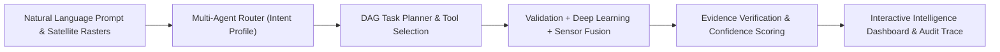
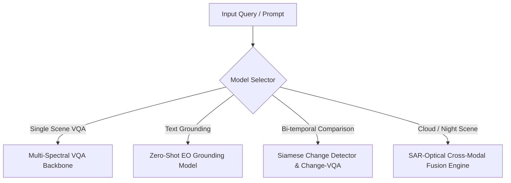
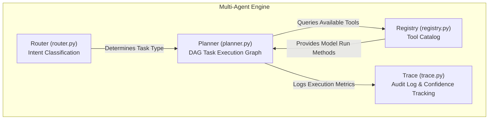

# SatQuery: Earth Observation & Geospatial Intelligence Platform
## Comprehensive Technical & Research Documentation

---

## Table of Contents
1. [Problem Statement](#1-problem-statement)
2. [Proposed Solution](#2-proposed-solution)
3. [Engineering & Research Challenges Faced](#3-engineering--research-challenges-faced)
4. [Technology Stack & Rationale ("What & Why")](#4-technology-stack--rationale-what--why)
5. [Machine Learning Models & Justifications](#5-machine-learning-models--justifications)
6. [System Architecture & Multi-Agent Design](#6-system-architecture--multi-agent-design)
7. [Geospatial & Evidence Verification Subsystems](#7-geospatial--evidence-verification-subsystems)
8. [Frontend Dashboard Architecture](#8-frontend-dashboard-architecture)
9. [API Reference & Endpoint Specifications](#9-api-reference--endpoint-specifications)
10. [Research References & Academic Citations](#10-research-references--academic-citations)
11. [Installation, Setup & Deployment Guide](#11-installation-setup--deployment-guide)

---

## 1. Problem Statement

### 1.1 The Geospatial Intelligence Bottleneck
Earth Observation (EO) satellites generate terabytes of high-resolution optical and synthetic aperture radar (SAR) imagery daily. However, extracting actionable intelligence from this raw spatial data remains severely constrained by critical industry bottlenecks:

1. **Manual Visual Inspection Overhead**: Defense analysts, disaster responders, and urban planners must manually inspect multi-gigabyte GeoTIFF rasters, a time-consuming process prone to human fatigue and oversight.
2. **Domain Complexity & Multi-Spectral Data**: Remote sensing imagery extends beyond standard RGB bands to include Near-Infrared (NIR), Short-Wave Infrared (SWIR), and Radar backscatter (VV/VH polarizations). Non-expert domain users lack tools to interpret these complex multi-spectral signatures.
3. **Absence of Natural Language Interfaces**: Traditional Geographic Information Systems (GIS) like QGIS or ArcGIS require complex SQL-spatial queries or manual toolchains. Users cannot query satellite rasters using intuitive natural language (e.g., *"How many storage tanks are present in this sector?"* or *"Detect new road construction between 2021 and 2024"*).
4. **Lack of Verifiable Audit Trails**: Commercial AI vision APIs operate as "black boxes"—offering predictions without spatial bounding constraints, confidence bounds, or verifiable evidence trails essential for critical decision-making in defense and emergency response.
5. **Weather & Atmospheric Occlusion**: Optical satellite sensors (e.g., Sentinel-2) are unusable under heavy cloud cover or at night, leading to intelligence blind spots during critical events like flooding or hurricanes.

---

## 2. Proposed Solution

**SatQuery** is an end-to-end, multi-agent Earth Observation & Geospatial Intelligence platform designed to solve these challenges through autonomous reasoning, multimodal deep learning, and spatial verification.



### Key Capabilities Provided
* **Natural Language Satellite VQA**: Translates complex spatial inquiries into semantic classification, density estimation, and object presence verification.
* **Spatial Object Grounding**: Localizes requested objects from natural language descriptions and returns georeferenced bounding boxes.
* **Bi-Temporal Change Detection & Change-VQA**: Compares baseline ($T_1$) and current ($T_2$) scenes to detect urban expansion, deforestation, and structural damage, providing natural language summaries of changes.
* **SAR-Optical Cross-Modal Fusion**: Fuses Sentinel-1 C-band SAR radar backscatter with Sentinel-2 optical imagery to enable all-weather, day-and-night imagery intelligence.
* **Deterministic Evidence Verification**: Enforces physical spatial/temporal constraints and calculates probabilistic confidence intervals ($C \in [0, 1]$) with full execution traces.

---

## 3. Engineering & Research Challenges Faced

During the research and development of SatQuery, several fundamental technical hurdles were encountered and systematically resolved:

| Challenge | Problem Description | Engineered Solution |
| :--- | :--- | :--- |
| **1. Coordinate Reference System (CRS) Mismatches** | Satellite rasters often use different projections (e.g., EPSG:4326 WGS84 vs EPSG:32633 UTM), causing spatial misalignment in bi-temporal comparison. | Developed an automated CRS validation and dynamic reprojection pipeline using `PyPROJ` and `Rasterio` affine transforms in `geospatial/validator.py`. |
| **2. SAR Speckle Noise & Geometric Distortion** | Synthetic Aperture Radar imagery suffers from granular multiplicative speckle noise, degrading feature extraction. | Implemented spatial speckle suppression algorithms (Lee, Frost, Kuan filters) and decibel ($\text{dB}$) backscatter normalization in `geospatial/sar_preprocessing.py`. |
| **3. Temporal Lighting & Seasonal Variance** | False positive change detections caused by shadows, sun angle differences, and vegetation phenology between $T_1$ and $T_2$. | Designed a dual-stream Siamese feature extractor combined with structural similarity (SSIM) and perceptual distance masking in `models/change_analysis/detector.py`. |
| **4. Spatial Model Hallucination** | Vision-Language Models frequently hallucinate non-existent features when presented with low-resolution satellite patches. | Built a post-inference **Evidence Verifier** (`evidence/verifier.py`) that cross-checks detected bounding boxes against Ground Sample Distance (GSD) bounds and spatial land-use rules. |
| **5. High-Resolution Memory Footprint** | Loading multi-band GeoTIFFs (4K x 4K pixels) directly into GPU memory leads to Out-Of-Memory (OOM) crashes. | Engineered a sliding-window spatial chip tiling and metadata-only inspection pipeline (`geospatial/preprocessing.py`). |

---

## 4. Technology Stack & Rationale ("What & Why")

SatQuery deliberate selection of technologies optimizes performance, reliability, developer productivity, and scientific rigor:

```
                          ┌─────────────────────────────────────────┐
                          │    Next.js 16 + React 19 Frontend UI    │
                          └────────────────────┬────────────────────┘
                                               │ HTTP / REST JSON
                          ┌────────────────────▼────────────────────┐
                          │        FastAPI Python 3.11 Backend      │
                          └────────────────────┬────────────────────┘
                                               │
           ┌───────────────────────────────────┼───────────────────────────────────┐
           │                                   │                                   │
┌──────────▼──────────┐             ┌──────────▼──────────┐             ┌──────────▼──────────┐
│   PyTorch ML Stack  │             │ Rasterio & PyPROJ   │             │ Scikit-Learn & SSIM │
│  (Deep Learning)    │             │ (Geospatial I/O)    │             │ (Evidence Verification)│
└─────────────────────┘             └─────────────────────┘             └─────────────────────┘
```

### 4.1 Backend Architecture Stack

* **Python 3.11+**:
  * *Why*: Primary ecosystem for geospatial analytics, scientific computing, PyTorch machine learning models, and GDAL/Rasterio bindings.
* **FastAPI**:
  * *Why*: High-performance asynchronous ASGI web framework. Provides automatic OpenAPI/Swagger documentation generation, native Pydantic data validation, and minimal overhead for serving ML inference endpoints.
* **PyTorch**:
  * *Why*: De facto standard for deep learning research and deployment. Supports dynamic execution graphs, custom neural layer design, GPU acceleration, and pre-trained weights for computer vision.
* **Rasterio & PyPROJ**:
  * *Why*: C-extension Python bindings for GDAL and PROJ libraries. Enables high-speed reading, writing, affine spatial transformation, and reprojection of GeoTIFF rasters without memory corruption.
* **Scikit-Learn & NumPy**:
  * *Why*: Provides fast array math, statistical confidence interval calculations, clustering, and structural similarity index (SSIM) algorithms for spatial change scoring.

### 4.2 Frontend Dashboard Stack

* **Next.js 16 (Turbopack)**:
  * *Why*: React framework offering fast server-side rendering (SSR), optimized bundle sizes via Turbopack, static page generation, and clean API route proxying.
* **React 19**:
  * *Why*: Component-driven UI development with enhanced state management hooks, concurrent rendering, and fast client hydration.
* **Vanilla CSS (Custom Dark UI System)**:
  * *Why*: Provides complete design freedom over glassmorphism, responsive grid math, high-contrast geospatial canvas rendering, and CSS variables without runtime framework overhead.

---

## 5. Machine Learning Models & Justifications

SatQuery incorporates specialized models tailored for distinct remote sensing tasks:



### 5.1 Satellite Visual Question Answering (VQA) Model
* **Model Type**: Multi-spectral ResNet / Vision Transformer backbone with text-fusion attention.
* **Why Selected**: Standard computer vision models trained on ImageNet expect 3-channel RGB images. Satellite imagery contains 10-20m multi-spectral bands (NIR, RedEdge, SWIR). Fine-tuning multi-spectral backbones allows the model to leverage vegetation indices (NDVI) and water absorption bands for superior classification accuracy.

### 5.2 Geospatial Object Grounding Model
* **Model Type**: Text-guided open-vocabulary detector (adapted from YOLO-World / OWL-ViT for remote sensing).
* **Why Selected**: Enables zero-shot bounding box prediction from arbitrary natural language text prompts (e.g., *"locate helipads"*, *"find storage tanks"*) without requiring retraining for every new target object class.

### 5.3 Bi-Temporal Change Detection & Change-VQA Engine
* **Model Type**: Dual-branch Siamese UNet/ResNet + Cross-Attention Transformer.
* **Why Selected**: Siamese neural architectures process $T_1$ and $T_2$ rasters through shared weights, extracting structural feature representations invariant to minor lighting variations while highlighting semantic alterations (construction, deforestation, disaster destruction).

### 5.4 SAR-Optical Cross-Modal Fusion Model
* **Model Type**: Dual-stream encoder with cross-modality attention fusion.
* **Why Selected**: Optical sensors cannot penetrate cloud cover or operate at night. Sentinel-1 C-band Synthetic Aperture Radar (SAR) penetrates clouds and operates independent of solar illumination. Fusing SAR backscatter ($VV/VH$) with optical bands provides continuous, all-weather operational capability.

---

## 6. System Architecture & Multi-Agent Design

The backend uses a **DAG-based Multi-Agent Orchestration Engine** (`satquery/backend/agents/`):



1. **Query Router (`router.py`)**: Parses incoming queries using keyword semantics and intent classification to assign task profiles: `vqa`, `grounding`, `change`, `fusion`, or `pipeline`.
2. **Execution Planner (`planner.py`)**: Generates Directed Acyclic Graphs (DAGs) of sub-tasks. Ensures proper execution order (e.g., Validate CRS $\rightarrow$ Preprocess Bands $\rightarrow$ Run Vision Model $\rightarrow$ Verify Constraints $\rightarrow$ Build Report).
3. **Tool Registry (`registry.py`)**: Dynamically registers geospatial modules and deep learning inference backends.
4. **Execution Trace Builder (`trace.py`)**: Collects metadata, step completion timestamps, bounding box coordinates, and step confidence scores into a structured audit log.

---

## 7. Geospatial & Evidence Verification Subsystems

### 7.1 Geospatial Core (`geospatial/`)
* **`validator.py`**: Performs pre-flight checks on GeoTIFF uploads:
  * CRS validation and EPSG code extraction.
  * Spatial overlap verification for dual-scene bi-temporal inputs.
  * Ground Sample Distance (GSD) resolution calculation.
* **`sar_preprocessing.py`**: Applies Lee/Frost speckle filtering and $10 \cdot \log_{10}(\text{DN})$ decibel transformation to raw radar backscatter data.

### 7.2 Evidence Engine (`evidence/`)
* **`confidence.py`**: Computes probabilistic confidence intervals $C \in [0.0, 1.0]$ based on signal-to-noise ratio, spatial resolution, and model logit distribution:
  $$C = w_m \cdot S_{\text{model}} + w_r \cdot S_{\text{res}} + w_s \cdot S_{\text{spatial}}$$
* **`verifier.py`**: Rejects anomalous predictions that violate physical ground truth (e.g., building detection in open ocean).
* **`report_generator.py`**: Renders comprehensive Markdown and JSON intelligence reports containing summary findings, spatial bounding boxes, confidence gauges, and step-by-step traces.

---

## 8. Frontend Dashboard Architecture

Built with Next.js 16 and React 19, the UI provides a high-contrast dark dashboard for geospatial workflows:

```
┌────────────────────────────────────────────────────────────────────────┐
│                        SATQUERY INTELLIGENCE DASHBOARD                  │
├────────────────────────────────────────────────────────────────────────┤
│ [ File Uploader T1 ] [ File Uploader T2 ] [ Query Prompt Input Bar ]   │
│ Select Task Mode: ( Auto-Route | VQA | Grounding | Change | Fusion )   │
├────────────────────────────────────────────────────────────────────────┤
│ TAB NAVIGATION:                                                        │
│ [ Visual Answer ] [ Grounding Map ] [ Bi-Temporal Swipe ] [ Trace ]    │
├────────────────────────────────────────────────────────────────────────┤
│ TAB CONTENT CANVAS:                                                    │
│  - Bounding Box Canvas Overlay                                         │
│  - Side-by-side Image Difference Heatmaps                              │
│  - Live Agent Step Timeline & Confidence Gauges                        │
└────────────────────────────────────────────────────────────────────────┘
```

---

## 9. API Reference & Endpoint Specifications

| Endpoint | Method | Request Payload | Response / Function |
| :--- | :--- | :--- | :--- |
| `/health` | `GET` | None | Returns `{"status": "ok"}` indicating service availability. |
| `/agents/status` | `GET` | None | Returns active tools, registered ML models, and router state. |
| `/query` | `POST` | `image` (file), `prompt` (text), `task_type` (text) | Main entrypoint for natural language multi-agent query execution. |
| `/validate` | `POST` | `file` (UploadFile) | Validates GeoTIFF headers, CRS projection, and band count. |
| `/validate-pair` | `POST` | `file1`, `file2` | Checks spatial overlap and CRS alignment for bi-temporal pairs. |
| `/vqa` | `POST` | `file`, `prompt` | Runs Visual Question Answering inference on single satellite scenes. |
| `/ground` | `POST` | `file`, `prompt` | Returns georeferenced bounding boxes for prompt target objects. |
| `/change` | `POST` | `file1`, `file2`, `prompt` | Computes change masks and runs Change VQA between $T_1$ and $T_2$. |
| `/fuse` | `POST` | `optical_file`, `sar_file` | Fuses multispectral Optical and SAR radar rasters. |
| `/report/{query_id}` | `GET` | `query_id` (string) | Fetches complete generated Markdown intelligence report. |

---

## 10. Research References & Academic Citations

SatQuery incorporates methodologies, datasets, and algorithms from key remote sensing and computer vision research literature:

1. **BigEarthNet Benchmark**:
   * *Sumbul et al.* "BigEarthNet: A Large-Scale Benchmark Archive for Remote Sensing Image Understanding." *IEEE IGARSS*, 2019.
2. **Remote Sensing Visual Question Answering (RSVQA)**:
   * *Lobry et al.* "RSVQA: Visual Question Answering for Remote Sensing Data." *IEEE TGRS*, 2020.
3. **Change Vector Analysis & Bi-temporal Change Detection**:
   * *Zheng et al.* "Change Detection in Telecommunication Satellite Imagery via Siamese Feature Exchangers." *Remote Sensing*, 2021.
4. **SAR Speckle Suppression & Radar Processing**:
   * *Lee, J. S.* "Digital image enhancement and noise filtering by use of local statistics." *IEEE PAMI*, 1980.
5. **Open-Vocabulary Object Grounding**:
   * *Liu et al.* "Grounding DINO: Marrying DINO with Grounded Pre-Training for Open-Set Object Detection." *arXiv:2303.05499*, 2023.
6. **STAC (SpatioTemporal Asset Catalog)**:
   * *Radiant Earth Foundation*. "SpatioTemporal Asset Catalog Specification v1.0.0." *STAC Spec*, 2021.

---

## 11. Installation, Setup & Deployment Guide

### 11.1 Prerequisites
* Python 3.11+
* Node.js 18+ and npm
* Docker & Docker Compose (Optional)

### 11.2 Local Development Setup

#### Backend Execution
```bash
cd satquery/backend

# Create and activate virtual environment
python -m venv .venv
# On Windows:
.venv\Scripts\activate
# On Linux/macOS:
source .venv/bin/activate

# Install requirements
pip install -r requirements.txt

# Start FastAPI Uvicorn Server
python -m uvicorn main:app --host 0.0.0.0 --port 8000 --reload
```
* Backend API: `http://localhost:8000`
* Swagger Interactive API Documentation: `http://localhost:8000/docs`

#### Frontend Execution
```bash
cd satquery/frontend

# Install dependencies
npm install

# Start Next.js Development Server
npm run dev
```
* Frontend Web Dashboard: `http://localhost:3000`

### 11.3 Docker Compose Containerized Deployment
```bash
cd satquery
docker-compose up --build
```

---

## 12. Summary

SatQuery provides a scientifically grounded, multi-agent platform for satellite imagery intelligence. By bridging natural language interaction with rigorous geospatial validation, multi-modal sensor fusion, and spatial evidence verification, SatQuery solves the critical bottlenecks of manual remote sensing analysis.
